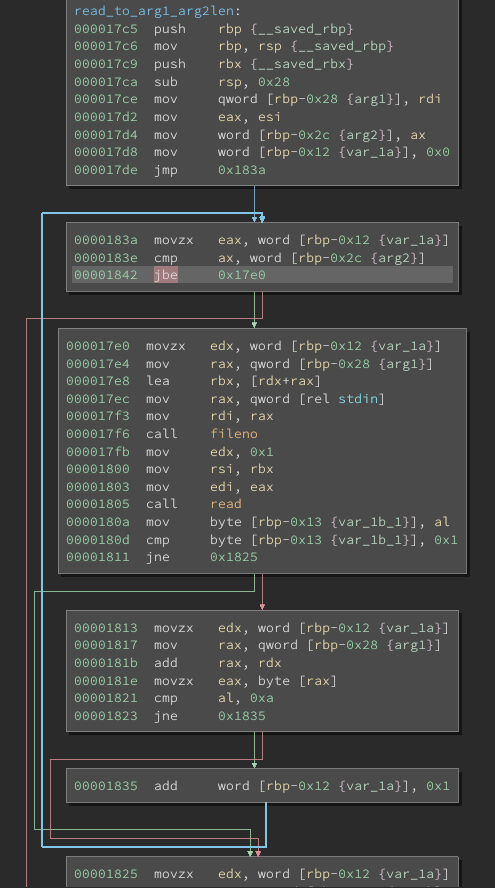
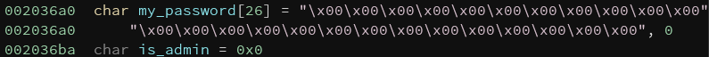

# PWNerandum

For this challenge we are provided with a stripped 64bit ELF binary with all protections enabled (RELRO, canary, NX, PIE), and 
the libc it uses on the remote server.
After disassembling the binary in ghidra, I noticed that there is a hidden menu, accessible only by a "premium user".
In order to access it, the program asks us to insert a password, which will be hashed and compared to some value
stored in rodata.

After unsuccessfully trying to guess the password by using hashcat and some rainbow tables online, I decided to look at the 
disassembled code a bit more in depth.

That's when I found out that the function used to read the input password has a buffer overflow vulnerability of one byte. 

Because the inputted password buffer (in the bss section) is immediately followed by the char which determines whether or 
not we are the "premium user", by overflowing into it and writing 0x1, we are able to gain the "premium user" privileges.

Such privileges allow us to access 2 new options in the menu: "modify memo" and "modify banner".

I decided to look into the "modify banner" function first since, at this point, I had already reversed the part of the 
binary that had to do with the notes, and wasn't able to find any vulnerabilities there. By fuzzing a bit with different 
lengths of inputs, I noticed that, when inserting a few more than 500 characters into the banner (so that my input would 
completely replace the default banner), the program would print a weird sequence of bytes ending in 0x7f. By looking at 
this behaviour more closely in gdb it was clear that it was the stack being overwritten.

By carefully crafting different banners with different lengths, we are now able to leak the canary, the saved ebp (which 
leaks PIE, but we won't need it), and the return address (which points somewhere inside a libc function, __libc_start_main), 
in this exact order.

After leaking them, we can craft a special banner containing the original canary (so we won't trigger the protection against 
stack smashing) and edit the return address to a magic gadget inside the libc.

Exiting the program now by selecting option '9' will trigger our exploit, and give us a shell to retrieve the flag.

## Flag

`ccit{0n3_byt3_t0_rul3_th3m_4ll}`

